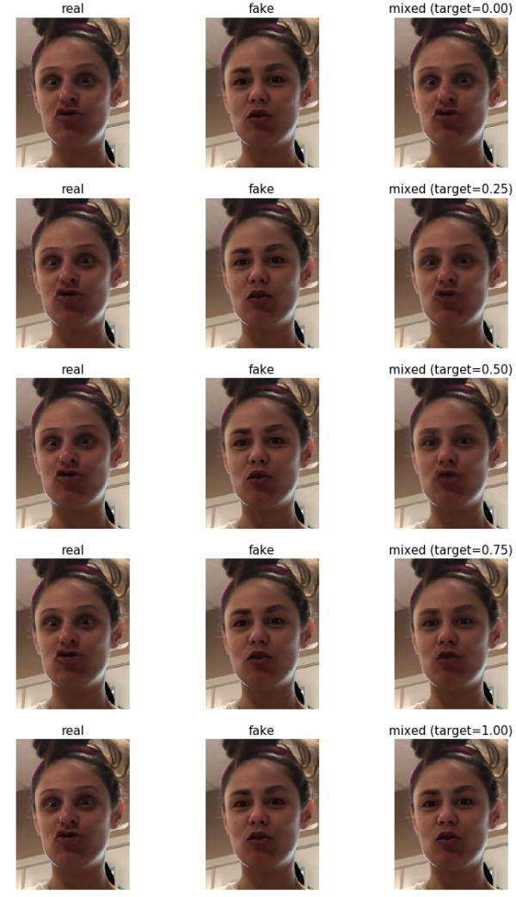
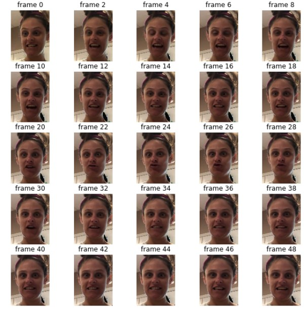
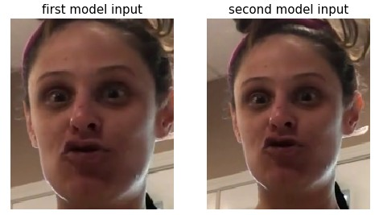
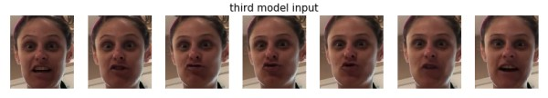
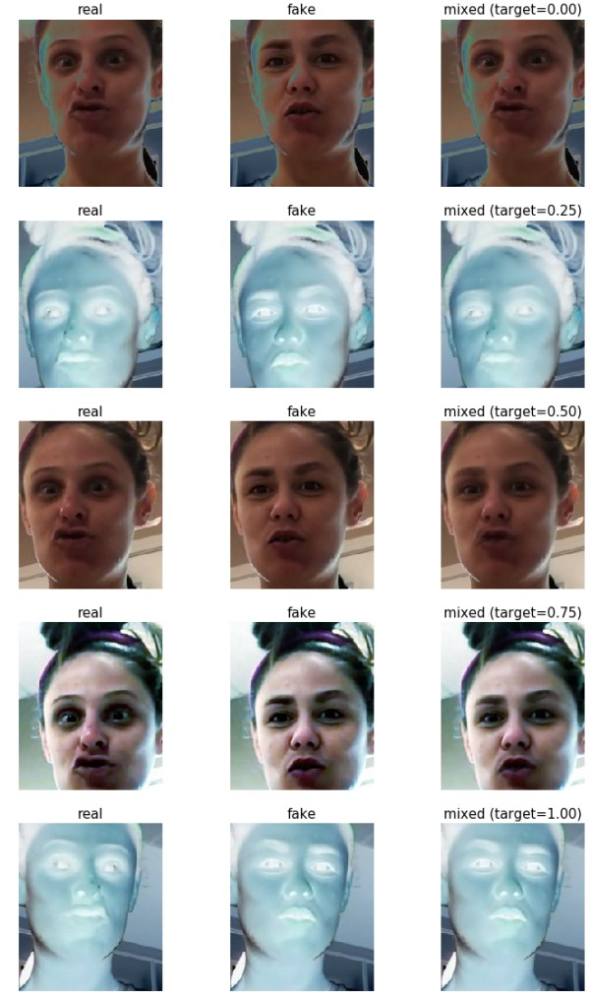
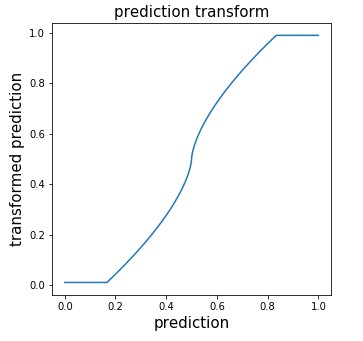

# Deepfake Detection Challenge
Solution for the [Deepfake Detection Challenge](https://www.kaggle.com/c/deepfake-detection-challenge).  
Private LB score: **0.43452**
## Solution description
### Summary
Our solution consists of three EfficientNet-B7 models (we used the Noisy Student pre-trained weights). We did not use 
external data, except for pre-trained weights. One model runs on frame sequences (a 3D convolution has been added to 
each EfficientNet-B7 block). The other two models work frame-by-frame and differ in the size of the face crop and 
augmentations during training. To tackle overfitting problem, we used mixup technique on aligned real-fake pairs. In 
addition, we used the following augmentations: AutoAugment, Random Erasing, Random Crops, Random Flips, and various 
video compression parameters. Video compression augmentation was done on-the-fly. To do this, short cropped tracks (50 
frames each) were saved in PNG format, and at each training iteration they were loaded and reencoded with random 
parameters using ffmpeg. Due to the mixup, model predictions were “uncertain”, so at the inference stage, model 
confidence was strengthened by a simple transformation. The final prediction was obtained by averaging the predictions 
of models with weights proportional to confidence.The total training and preprocessing time is approximately 5 days on 
DGX-1.
### Key ingredients
#### Mixup on aligned real-fake pairs
One of the main difficulties of this competition is a severe overfitting. Initially, all models overfitted in 2-3 epochs 
(the validation loss started to increase). The idea, which helped a lot with the overfitting, is to train the model on 
a mix of real and fake faces: for each fake face, we take the corresponding real face from the original video (with the 
same box coordinates and the same frame number) an do a linear combination of them. In terms of tensor it’s  
```python
input_tensor = (1.0 - target) * real_input_tensor + target * fake_input_tensor
```
where target is drawn from a Beta distribution with parameters alpha=beta=0.5. With these parameters, there is a very 
high probability of picking values close to 0 or 1 (pure real or pure fake face). You can see the examples below:  
  
Due to the fact that real and fake samples are aligned, the background remains almost unchanged on interpolated samples, 
which reduces overfitting and makes the model pay more attention to the face.
#### Video compression augmentation
In the paper \[1\] it was pointed out that augmentations close to degradations seen in real-life video distributions 
were applied to the test data. Specifically, these augmentations were (1) reduce the FPS of the video to 15; (2) reduce 
the resolution of the video to 1/4 of its original size; and (3) reduce the overall encoding quality. In order to make 
the model resistant to various parameters of video compression, we added augmentations with random parameters of video 
encoding to training. It would be infeasible to apply such augmentations to the original videos on-the-fly during 
training, so instead of the original videos, cropped (1.5x areas around the face) short (50 frames) clips were used. 
Each clip was saved as separate frames in png format. An example of a clip is given below:  
  
 For on-the-fly augmentation, ffmpeg-python was used. At each iteration, the following parameters were randomly sampled 
 (see \[2\]):
- FPS (15 to 30)
- scale (0.25 to 1.0)
- CRF (17 to 40)
- random tuning option
#### Model architecture
As a result of the experiments, we found out that the EfficientNet models work better than others (we checked ResNet, 
ResNeXt, SE-ResNeXt). The best model was EfficientNet-B7 with Noisy Student pre-trained weights \[3\]. The size of the 
input image is 224x192 (most of the faces in the training dataset are smaller). The final ensemble consists of three 
models, two of which are frame-by-frame, and the third works on sequence.
##### Frame-by-frame models
Frame-by-frame models work quite well. They differ in the size of the area around the face and augmentations during 
training. Below are examples of input images for each of the models:  
  
##### Sequence-based model
Probably, time dependencies can be useful for detecting fakes. Therefore, we added a 3d convolution to each block of the 
EfficientNet model. This model worked slightly better than similar frame-by-frame model. The length of the input 
sequence is 7 frames. The step between frames is 1/15 of a second. An example of an input sequence is given below:  
  
#### Image augmentations
To improve model generalization, we used the following augmentations: AutoAugment \[4\], Random Erasing, Random Crops, 
Random Horizontal Flips. Since we used mixup, it was important to augment real-fake pairs the same way (see example). 
For a sequence-based model, it was important to augment frames that belong to the same clip in the same way.  

#### Inference post-processing
Due to mixup, the predictions of the models were uncertain, which was not optimal for the logloss. To increase 
confidence, we applied the following transformation:  
  
Due to computational limitations, predictions are made on a subsample of frames. Half of the frames were horizontally 
flipped. The prediction for the video is obtained by averaging all the predictions with weights proportional to the 
confidence (the closer the prediction to 0.5, the lower its weight). Such averaging works like attention, because the 
model gives predictions close to 0.5 on poor quality frames (profile faces, blur, etc.). 
#### References
\[1\] Brian Dolhansky, Russ Howes, Ben Pflaum, Nicole Baram, Cristian Canton Ferrer, “The Deepfake Detection Challenge 
(DFDC) Preview Dataset”  
\[2\] [https://trac.ffmpeg.org/wiki/Encode/H.264](https://trac.ffmpeg.org/wiki/Encode/H.264)  
\[3\] Qizhe Xie, Minh-Thang Luong, Eduard Hovy, Quoc V. Le, “Self-training with Noisy Student improves ImageNet classification”  
\[4\] Ekin D. Cubuk, Barret Zoph, Dandelion Mane, Vijay Vasudevan, Quoc V. Le, “AutoAugment: Learning Augmentation Policies from Data”
## The hardware we used
- CPU: Intel(R) Xeon(R) CPU E5-2698 v4 @ 2.20GHz
- GPU: 8x NVIDIA Tesla V100 SXM2 32 GB
- RAM: 512 GB
- SSD: 6 TB
## Prerequisites
### Environment
Use the docker to get an environment close to what was used in the training. Run the following command to build the docker image:
```bash
cd path/to/solution
sudo docker build -t dfdc .
```
### Data
Download the [deepfake-detection-challenge-data](https://www.kaggle.com/c/deepfake-detection-challenge/data) and extract all files to `/path/to/dfdc-data`. This directory must have the following structure:
```
dfdc-data
├── dfdc_train_part_0
├── dfdc_train_part_1
├── dfdc_train_part_10
├── dfdc_train_part_11
├── dfdc_train_part_12
├── dfdc_train_part_13
├── dfdc_train_part_14
├── dfdc_train_part_15
├── dfdc_train_part_16
├── dfdc_train_part_17
├── dfdc_train_part_18
├── dfdc_train_part_19
├── dfdc_train_part_2
├── dfdc_train_part_20
├── dfdc_train_part_21
├── dfdc_train_part_22
├── dfdc_train_part_23
├── dfdc_train_part_24
├── dfdc_train_part_25
├── dfdc_train_part_26
├── dfdc_train_part_27
├── dfdc_train_part_28
├── dfdc_train_part_29
├── dfdc_train_part_3
├── dfdc_train_part_30
├── dfdc_train_part_31
├── dfdc_train_part_32
├── dfdc_train_part_33
├── dfdc_train_part_34
├── dfdc_train_part_35
├── dfdc_train_part_36
├── dfdc_train_part_37
├── dfdc_train_part_38
├── dfdc_train_part_39
├── dfdc_train_part_4
├── dfdc_train_part_40
├── dfdc_train_part_41
├── dfdc_train_part_42
├── dfdc_train_part_43
├── dfdc_train_part_44
├── dfdc_train_part_45
├── dfdc_train_part_46
├── dfdc_train_part_47
├── dfdc_train_part_48
├── dfdc_train_part_49
├── dfdc_train_part_5
├── dfdc_train_part_6
├── dfdc_train_part_7
├── dfdc_train_part_8
├── dfdc_train_part_9
└── test_videos
```

### External data
According to the rules of the competition, external data is allowed. The solution does not use other external data, except for pre-trained models. Below is a table with information about these models.

| File Name | Source | Direct Link | Forum Post |
| --------- | ------ | ----------- | ---------- |
| WIDERFace_DSFD_RES152.pth | [github](https://github.com/Tencent/FaceDetection-DSFD/tree/31aa8bdeaf01a0c408adaf2709754a16b17aec79) | [google drive](https://drive.google.com/file/d/1WeXlNYsM6dMP3xQQELI-4gxhwKUQxc3-/view) | [link](https://www.kaggle.com/c/deepfake-detection-challenge/discussion/121203#761391) |
| noisy_student_efficientnet-b7.tar.gz | [github](https://github.com/tensorflow/tpu/tree/4719695c9128622fb26dedb19ea19bd9d1ee3177/models/official/efficientnet) | [link](https://storage.googleapis.com/cloud-tpu-checkpoints/efficientnet/noisystudent/noisy_student_efficientnet-b7.tar.gz) | [link](https://www.kaggle.com/c/deepfake-detection-challenge/discussion/121203#748358) |  

Download these files and copy them to the `external_data` folder. 

## How to train the model
Run the docker container with the paths correctly mounted:
```bash
sudo docker run --runtime=nvidia -i -t -d --rm --ipc=host -v /path/to/dfdc-data:/kaggle/input/deepfake-detection-challenge:ro -v /path/to/solution:/kaggle/solution --name dfdc dfdc
sudo docker exec -it dfdc /bin/bash
cd /kaggle/solution
```
Convert pre-trained model from tensorflow to pytorch:
```bash
bash convert_tf_to_pt.sh
```
Detect faces on videos:
```bash
python3.6 detect_faces_on_videos.py
```
_Note: You can parallelize this operation using the `--part` and `--num_parts` arguments_  
Generate tracks:
```bash
python3.6 generate_tracks.py
```
Generate aligned tracks:
```bash
python3.6 generate_aligned_tracks.py
```
Extract tracks from videos:
```bash
python3.6 extract_tracks_from_videos.py
```
_Note: You can parallelize this operation using the `--part` and `--num_parts` arguments_  
Generate track pairs:
```bash
python3.6 generate_track_pairs.py
```
Train models:
```bash
python3.6 train_b7_ns_aa_original_large_crop_100k.py
python3.6 train_b7_ns_aa_original_re_100k.py
python3.6 train_b7_ns_seq_aa_original_100k.py
```
Copy the final weights and convert them to FP16:
```bash
python3.6 copy_weights.py
```
## Serialized copy of the trained model
You can download the final weights that were used in the competition (the result of the `copy_weights.py` script): [GoogleDrive](https://drive.google.com/file/d/1S-HeppZcbXDF0F-BO96zhqZyrRWOaan6/view?usp=sharing)
## How to generate submission
Run the following command
```bash
python3.6 predict.py
```